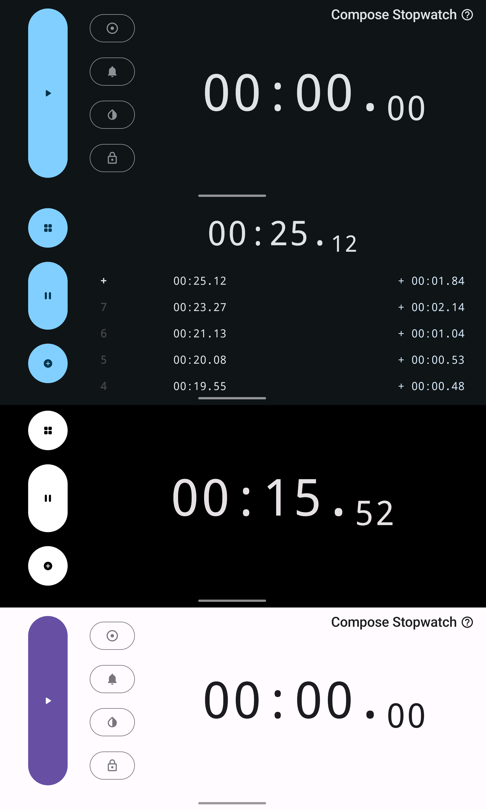

<!--suppress ALL -->

    
    <h1>Compose Stopwatch</h1>
    
Android stopwatch in the Material You theme, designed for ease of use and best feature

    
<code>App in 5 languages: En, De, Fr, Es, Ru</code>

    

        
        
    

  
  
  

  
  
  

### Compose Stopwatch
This is an open source stopwatch app in the Material You theme, designed for ease of use and best features

- Change theme, new themes are available
    - Dynamic theme is only available with android 12+
    - Extra Dark theme saves charging for Amoled screen

- Change orientation
    - Portrait mode has more space for laps
    - In Landscape mode, time text is larger

- Select an action when you tap on the clock that shows the time
    - Resume or pause
    - Resume or add lap
    - Resume or pause
    - If you don't want to do this, you can remove the action

- Switching notifications on/off
    - Stopwatch control in notifications
    - When switched off, the stopwatch works on ViewModel and DataStore
    - When enabled, the stopwatch works on LifecycleService and ForegroundService

- Screen Awake mode
     - Ability to watch the stopwatch without the screen falling asleep

Author: JustDeax (https://github.com/JustDeax)

Version: 1.7.2

Minimal android: 7 (SDK 24)
